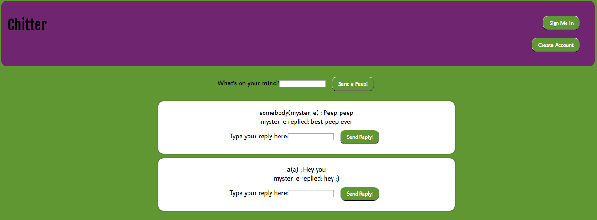

chitter
=======

Week 6 Friday Challenge at Makers Academy - Build a twitter clone (chitter)

Screenshot:


View the live app here: http://still-inlet-7393.herokuapp.com/


###Specification

+ Users sign up to chitter with their email, password, name and a user name 
+ The username and email are unique
+ Peeps (posts to chitter) have the name of the maker and their user handle
+ Use data mapper and postgres to save the data
+ You don't have to be logged in to see the peeps
+ Users can reply to peeps

###Technologies used

+ Ruby
+ RSPEC
+ Sinatra
+ BCrypt
+ Datamapper
+ PSQL
+ Capybara
+ Heroku

###How to set it up

```sh
git clone https://github.com/aitkenster/chitter.git
cd chitter
bundle install
```

###How to run it

```sh
cd chitter
rackup
```

go to localhost:9292 in your browser to view the app

###How to test it

```sh
cd chitter
rspec
``` 

###Future Improvements

+ The CSS has been described as teenage mutant ninja turtle themed! Definitely needs work.
+ Currently the database only stores one reply to a peep. I would implement the ability to store multiple replies.
+ Ability to reset password
